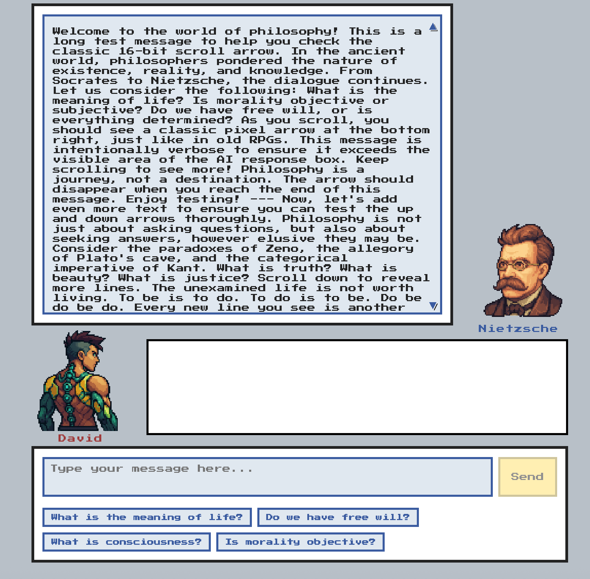

# The Dialogue — Frontend

This is the frontend part of **The Dialogue**, a retro-inspired React app for philosophical conversations, featuring avatars and scrollable message panels. Built with Vite for fast development and modern tooling.

## Features
- AI and user avatars (Nietzsche and David) with names displayed below
- Scrollable message panels for both user and AI responses
- Responsive, pixel-art styled UI
- Quick question pills for fast input
- Modern React (hooks) and Vite setup

## Getting Started

### Prerequisites
- Node.js (v16 or newer recommended)
- npm (comes with Node.js)

### Installation
1. Navigate to the frontend directory:
   ```sh
   cd the-dialogue-frontend
   ```
2. Install dependencies:
   ```sh
   npm install
   ```

### Running the App
Start the development server:
```sh
npm run dev
```
The app will be available at the URL shown in your terminal (usually http://localhost:5173).

### Building for Production
```sh
npm run build
```

### Linting
```sh
npm run lint
```

## Project Structure
- `src/components/` — React components (AI/User panels, input, etc.)
- `src/assets/` — Avatar images and other static assets
- `src/App.jsx` — Main app logic
- `src/App.css` — Main styles

## Credits
- **User avatar (David):** `src/assets/u-david.png`
- **AI avatar (Nietzsche):** `src/assets/p-nietzsche-calm.png`
- Pixel font: [Press Start 2P](https://fonts.google.com/specimen/Press+Start+2P)

## License
This project is for educational and demonstration purposes.

## Screenshot


